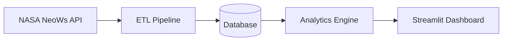

# Neo Analytics Platform

A Python-based analytics platform for ingesting, processing, scoring, and visualizing near-Earth object (NEO) data using NASA's NeoWs API.

---

# Project Overview

## Problem Statement

Near-Earth objects (NEOs), such as asteroids and comets, represent an important area of scientific monitoring and planetary defense research. NASA provides large volumes of asteroid and close-approach data through the NeoWs (Near Earth Object Web Service) API, but raw API data alone can be difficult to analyze, interpret, and visualize effectively.

This project addresses that problem by building a structured analytics pipeline capable of:
- retrieving asteroid data from NASA APIs
- transforming and cleaning raw JSON payloads
- storing historical records
- calculating analytical risk metrics
- presenting results through an interactive dashboard

---

## Purpose

The purpose of this project is to create a scalable analytics platform that demonstrates:
- API integration
- ETL workflows
- database management
- analytical scoring systems
- interactive data visualization
- professional software engineering practices

The platform is designed as both:
1. a technical learning project
2. a foundation for future production-scale analytics development

---

## NASA Datasets Used

Primary data source:

### NASA NeoWs API
Near Earth Object Web Service (NeoWs)

Provides:
- asteroid metadata
- close-approach records
- estimated object size
- velocity measurements
- hazardous object classifications
- orbital information

Future dataset integrations may include:
- NASA APOD API
- JPL Small-Body Database
- additional astronomy and planetary defense datasets

---

# System Architecture



---

# Project Structure

```text
src/
  config.py            application configuration (secrets + operational tuning)
  logging.py            rotating file logging setup
  run_pipeline.py        ETL pipeline entry point/orchestration
  etl/                  NASA NeoWs API requests (feed + orbital parameters)
  parsing/               raw JSON -> DB-ready asteroid/close-approach records
  transform/              raw JSON -> DB-ready orbital-parameter records
  db/                    SQLite connection, schema init, inserts, ingestion audit log
  models/                risk scoring engine + weights.json
  dashboard/              Streamlit app
    pages/                  Risk Rankings / Explorer / Analytics / Model Card
tests/                  mirrors src/ package-for-package
  fixtures/               shared representative sample dataset
sql/                    schema.sql, validation_queries.sql
data/                   raw/processed datasets (gitignored, generated locally)
docs/                   architecture, configuration, testing, Docker, model docs
notebooks/              exploratory analysis and prototyping
.github/workflows/      CI (lint + test on every push/PR)
Dockerfile, .dockerignore   containerized execution (see docs/docker.md)
```

| Directory | Purpose |
|---|---|
| `src/` | Core application source code |
| `tests/` | Unit and integration tests, structured to mirror `src/` |
| `sql/` | Database schema and validation queries |
| `data/` | Raw and processed datasets (gitignored — generated locally, not versioned) |
| `docs/` | Architecture and technical documentation — see the index below |
| `notebooks/` | Experimental analysis and prototyping |
| `.github/workflows/` | CI pipeline definition |

---

# Documentation Index

**Engineering**
- [`docs/architecture.md`](docs/architecture.md) — system architecture and component overview
- [`docs/dashboard_architecture.md`](docs/dashboard_architecture.md) — dashboard UX design, navigation, and as-built implementation
- [`docs/configuration.md`](docs/configuration.md) — every configuration value, its default, and where it's used
- [`docs/testing_strategy.md`](docs/testing_strategy.md) — what's tested, what's deliberately excluded, and why
- [`docs/docker.md`](docs/docker.md) — building and running the app in Docker, including troubleshooting

**Data & schema**
- [`docs/schema_design.md`](docs/schema_design.md) / [`docs/schema_design_rationale.md`](docs/schema_design_rationale.md) / [`docs/schema_documentation.md`](docs/schema_documentation.md) — database schema and design decisions
- [`docs/entity_mapping.md`](docs/entity_mapping.md) / [`docs/er_diagram.md`](docs/er_diagram.md) — entity relationships
- [`docs/neows_api_notes.md`](docs/neows_api_notes.md) / [`docs/json_structure_analysis.md`](docs/json_structure_analysis.md) — NASA API response shape notes

**Risk model**
- [`docs/risk_model_design.md`](docs/risk_model_design.md) — scoring methodology
- [`docs/risk_model_card.md`](docs/risk_model_card.md) — model card: formula, weights, documented limitations

**Epic 7 process**
- [`docs/technical_debt_register.md`](docs/technical_debt_register.md) — prioritized technical debt register
- [`docs/epic_7_progress.md`](docs/epic_7_progress.md) — story-by-story progress log for the engineering-excellence epic

---

# Local Development Setup

## 1. Clone Repository

```bash
git clone https://github.com/Mission-Insight/neo-analytics-platform.git
cd neo-analytics-platform
```

---

## 2. Create Virtual Environment

### Windows

```bash
python -m venv venv
venv\Scripts\activate
```

### macOS/Linux

```bash
python3 -m venv venv
source venv/bin/activate
```

---

## 3. Install Dependencies

```bash
pip install -r requirements.txt
```

---

## 4. Configure Environment Variables

Create a local `.env` file:

```env
NASA_API_KEY=your_api_key_here
```

Environment template:

```text
.env.example
```

See `docs/configuration.md` for the full list of required and optional settings.

---

## 5. Run Validation

### Format code

```bash
black .
```

### Run linting

```bash
flake8 .
```

### Run tests

```bash
pytest
```

With coverage:

```bash
pytest --cov --cov-report=term-missing
```

See `docs/testing_strategy.md` for what's tested, what's deliberately excluded and why, and how the shared test fixtures work.

---

## 6. Run with Docker

```bash
docker build -t neo-analytics-platform .
docker run -p 8501:8501 --env-file .env -v "${PWD}/data/database:/app/data/database" neo-analytics-platform
```

Then open `http://localhost:8501`. See `docs/docker.md` for prerequisites, platform-specific command variants, running the ingestion pipeline inside a container, and troubleshooting.

---

# Development Tooling

This project includes:
- Black formatting
- Flake8 linting
- VS Code debug profiles
- Format-on-save
- Real-time lint diagnostics
- Feature branch workflow
- Git branch protections

---

# Developer Workflow

## Branching

Feature branches follow `feature/neo-<epic-number>-<short-description>` (e.g. `feature/neo-7-engineering-excellence`), branched from `main`.

## Before pushing

Run the same checks CI will run, so a failure shows up locally first rather than in the Actions tab:

```bash
black .
flake8 .
pytest
```

## Pull requests

- Open a PR from your feature branch into `main`.
- CI (`.github/workflows/ci.yml`) runs lint and the full test suite automatically on every push and PR — see `docs/testing_strategy.md` for what the test suite covers.
- `main` is protected: the "Lint & Test" check must pass, and at least one approving review is required, before a PR can merge.
- If CI fails, check the failing step's log on the Actions tab rather than guessing — see `docs/docker.md`'s troubleshooting table for Docker-specific failures, or the "Run Validation" commands above to reproduce a lint/test failure locally.

## Commits

Favor small, focused commits with messages that explain *why* a change was made, not just what changed — the diff already shows what changed.

---

# Future Scaling Opportunities

## PostgreSQL Migration

Transition from SQLite to PostgreSQL for:
- improved scalability
- concurrent access support
- production-grade persistence

---

## FastAPI Backend

Introduce FastAPI service endpoints for:
- analytics APIs
- risk scoring APIs
- external integrations

---

## Cloud Deployment

Potential deployment targets:
- AWS
- Azure
- Google Cloud
- Render
- Railway
- Streamlit Cloud

Future deployment goals:
- scheduled ETL execution
- public dashboards
- automated workflows
- scalable analytics infrastructure

---

# Project Roadmap

## NEO-1 — Professional Engineering Foundation

Establish the core engineering environment and repository standards.

Key objectives:
- repository setup
- GitHub organization and branch protections
- project scaffolding
- virtual environment configuration
- dependency management
- VS Code tooling setup
- linting and formatting
- architecture documentation
- professional README creation

---

## NEO-2 — Data Acquisition & API Integration

Build the NASA NeoWs integration layer.

Key objectives:
- authenticate with NASA APIs
- implement API request workflows
- retrieve near-Earth object datasets
- validate and parse JSON payloads
- handle API rate limits and failures

Primary modules:
- `src/etl/fetch_neows.py`
- `src/parsing/parse_asteroids.py`, `src/parsing/parse_close_approaches.py`

---

## NEO-3 — Data Engineering & Persistence Layer

Design the storage and persistence architecture.

Key objectives:
- normalize incoming data
- build ETL workflows
- implement SQLite persistence
- support historical record storage
- design scalable database access patterns

Primary module:
- `src/db/` (`connection.py`, `init_db.py`, `load_asteroids.py`, `load_close_approaches.py`, `load_orbital_parameters.py`, `log_ingestion.py`)

Future scaling target:
- PostgreSQL migration

---

## NEO-4 — Exploratory Analysis & Scientific Insight

Perform exploratory analysis on asteroid and near-Earth object data.

Key objectives:
- identify trends and anomalies
- analyze object velocity and distance metrics
- evaluate hazardous object classifications
- explore scientific and operational insights

Potential tooling:
- pandas
- numpy
- Jupyter notebooks

---

## NEO-5 — Risk Scoring Engine

Develop a quantitative risk assessment system.

Key objectives:
- calculate asteroid risk scores
- combine hazard indicators
- analyze object size and velocity
- prioritize high-interest objects
- support future scoring model expansion

Primary module:
- `src/models/risk_score.py`

---

## NEO-6 — Analytics Product Dashboard

Build the user-facing analytics interface.

Key objectives:
- develop Streamlit dashboard
- visualize asteroid analytics
- display risk scoring outputs
- support filtering and exploration
- present interactive charts and metrics

Primary module:
- `src/dashboard/` (`app.py`, `data_service.py`, `layout.py`, `palette.py`, `ui_settings.py`, `pages/`)

---

## NEO-7 — Engineering Excellence & Production Readiness

Transform the functional prototype into a maintainable, testable, reliable, professionally engineered product. See `docs/epic_7_progress.md` for the full story-by-story log.

Status by sub-story:
- ✅ 7.1 Technical Debt Assessment
- ✅ 7.2 Code Refactoring
- ✅ 7.3 Automated Testing
- ✅ 7.4 Logging & Observability
- ✅ 7.5 Configuration Management
- ✅ 7.6 Continuous Integration
- ✅ 7.7 Dockerization
- 🔄 7.8 Documentation Excellence (in progress)
- ⬜ 7.9 Performance Review
- ⬜ 7.10 Engineering Readiness Review
- ⬜ 7.11 Engineering Retrospective

Potential future technologies (beyond this epic):
- FastAPI
- PostgreSQL
- cloud infrastructure