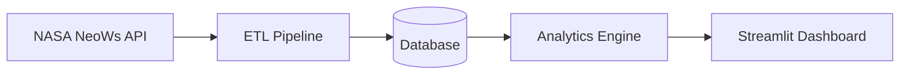

# Neo Analytics Platform

A Python-based analytics platform for ingesting, processing, scoring, and visualizing near-Earth object (NEO) data using NASA's NeoWs API.

---

# Project Overview

## Problem Statement

Near-Earth objects (NEOs), such as asteroids and comets, represent an important area of scientific monitoring and planetary defense research. NASA provides large volumes of asteroid and close-approach data through the NeoWs (Near Earth Object Web Service) API, but raw API data alone can be difficult to analyze, interpret, and visualize effectively.

This project addresses that problem by building a structured analytics pipeline capable of:
- retrieving asteroid data from NASA APIs
- transforming and cleaning raw JSON payloads
- storing historical records
- calculating analytical risk metrics
- presenting results through an interactive dashboard

---

## Purpose

The purpose of this project is to create a scalable analytics platform that demonstrates:
- API integration
- ETL workflows
- database management
- analytical scoring systems
- interactive data visualization
- professional software engineering practices

The platform is designed as both:
1. a technical learning project
2. a foundation for future production-scale analytics development

---

## NASA Datasets Used

Primary data source:

### NASA NeoWs API
Near Earth Object Web Service (NeoWs)

Provides:
- asteroid metadata
- close-approach records
- estimated object size
- velocity measurements
- hazardous object classifications
- orbital information

Future dataset integrations may include:
- NASA APOD API
- JPL Small-Body Database
- additional astronomy and planetary defense datasets

---

# System Architecture



---

# Project Structure

```text
src/
data/
tests/
docs/
notebooks/
```

| Directory | Purpose |
|---|---|
| `src/` | Core application source code |
| `data/` | Raw and processed datasets |
| `tests/` | Unit and integration tests |
| `docs/` | Architecture and technical documentation |
| `notebooks/` | Experimental analysis and prototyping |

---

# Local Development Setup

## 1. Clone Repository

```bash
git clone https://github.com/Mission-Insight/neo-analytics-platform.git
cd neo-analytics-platform
```

---

## 2. Create Virtual Environment

### Windows

```bash
python -m venv venv
venv\Scripts\activate
```

### macOS/Linux

```bash
python3 -m venv venv
source venv/bin/activate
```

---

## 3. Install Dependencies

```bash
pip install -r requirements.txt
```

---

## 4. Configure Environment Variables

Create a local `.env` file:

```env
NASA_API_KEY=your_api_key_here
```

Environment template:

```text
.env.example
```

See `docs/configuration.md` for the full list of required and optional settings.

---

## 5. Run Validation

### Format code

```bash
black .
```

### Run linting

```bash
flake8 .
```

### Run tests

```bash
pytest
```

---

# Development Tooling

This project includes:
- Black formatting
- Flake8 linting
- VS Code debug profiles
- Format-on-save
- Real-time lint diagnostics
- Feature branch workflow
- Git branch protections

---

# Future Scaling Opportunities

## PostgreSQL Migration

Transition from SQLite to PostgreSQL for:
- improved scalability
- concurrent access support
- production-grade persistence

---

## FastAPI Backend

Introduce FastAPI service endpoints for:
- analytics APIs
- risk scoring APIs
- external integrations

---

## Cloud Deployment

Potential deployment targets:
- AWS
- Azure
- Google Cloud
- Render
- Railway
- Streamlit Cloud

Future deployment goals:
- scheduled ETL execution
- public dashboards
- automated workflows
- scalable analytics infrastructure

---

# Project Roadmap

## NEO-1 — Professional Engineering Foundation

Establish the core engineering environment and repository standards.

Key objectives:
- repository setup
- GitHub organization and branch protections
- project scaffolding
- virtual environment configuration
- dependency management
- VS Code tooling setup
- linting and formatting
- architecture documentation
- professional README creation

---

## NEO-2 — Data Acquisition & API Integration

Build the NASA NeoWs integration layer.

Key objectives:
- authenticate with NASA APIs
- implement API request workflows
- retrieve near-Earth object datasets
- validate and parse JSON payloads
- handle API rate limits and failures

Primary modules:
- `fetch_neows.py`
- `parse_data.py`

---

## NEO-3 — Data Engineering & Persistence Layer

Design the storage and persistence architecture.

Key objectives:
- normalize incoming data
- build ETL workflows
- implement SQLite persistence
- support historical record storage
- design scalable database access patterns

Primary module:
- `db.py`

Future scaling target:
- PostgreSQL migration

---

## NEO-4 — Exploratory Analysis & Scientific Insight

Perform exploratory analysis on asteroid and near-Earth object data.

Key objectives:
- identify trends and anomalies
- analyze object velocity and distance metrics
- evaluate hazardous object classifications
- explore scientific and operational insights

Potential tooling:
- pandas
- numpy
- Jupyter notebooks

---

## NEO-5 — Risk Scoring Engine

Develop a quantitative risk assessment system.

Key objectives:
- calculate asteroid risk scores
- combine hazard indicators
- analyze object size and velocity
- prioritize high-interest objects
- support future scoring model expansion

Primary module:
- `risk_score.py`

---

## NEO-6 — Analytics Product Dashboard

Build the user-facing analytics interface.

Key objectives:
- develop Streamlit dashboard
- visualize asteroid analytics
- display risk scoring outputs
- support filtering and exploration
- present interactive charts and metrics

Primary module:
- `app.py`

---

## NEO-7 — Production Hardening & Quality Engineering

Improve system reliability, maintainability, and deployment readiness.

Key objectives:
- automated testing
- lint validation
- debugging workflows
- CI/CD preparation
- Docker support
- environment standardization
- cloud deployment preparation

Potential future technologies:
- FastAPI
- Docker
- PostgreSQL
- cloud infrastructure