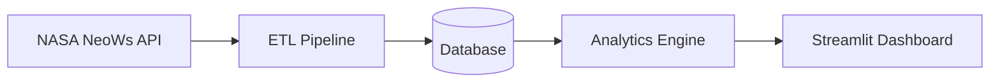
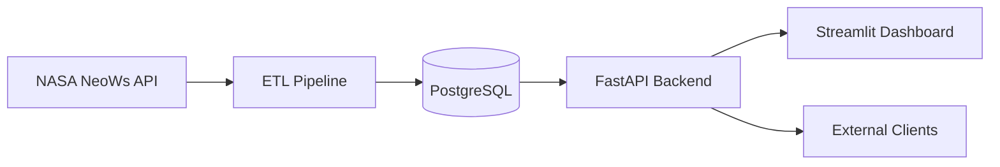

# System Architecture

## High-Level Flow

---

## Component Overview

### NASA NeoWs API Layer

Responsible for retrieving near-Earth object data from NASA's NeoWs (Near Earth Object Web Service).

Primary responsibilities:
- Authenticate using NASA API key
- Fetch asteroid and near-Earth object data
- Handle API requests and responses
- Parse incoming JSON payloads

Primary module:
- `fetch_neows.py`

---

### ETL Pipeline

Handles the Extract, Transform, and Load workflow for incoming API data.

#### Extract
Retrieve raw data from NASA APIs.

#### Transform
Clean, normalize, validate, and structure incoming records.

#### Load
Store processed records for analytics and dashboard consumption.

Primary modules:
- `fetch_neows.py`
- `parse_data.py`

---

### Database Layer

Stores processed application and analytics data.

Current implementation target:
- SQLite (local development)

Potential future implementation:
- PostgreSQL (production-scale deployment)

Primary module:
- `db.py`

Responsibilities:
- Data persistence
- Query management
- Record indexing
- Historical data retention

---

### Analytics Engine

Processes stored data and generates analytical insights and scoring metrics.

Primary module:
- `risk_score.py`

Potential analytics:
- Hazard classification
- Distance-based risk scoring
- Velocity analysis
- Object size categorization
- Trend analysis

---

### Streamlit Dashboard

Provides the user-facing analytics and visualization interface.

Primary module:
- `app.py`

Dashboard responsibilities:
- Display asteroid analytics
- Present risk scores
- Visualize trends and metrics
- Support interactive exploration

---

## Planned Workflow

1. Retrieve asteroid data from NASA NeoWs API
2. Transform and validate incoming records
3. Store processed data in database
4. Run analytics and scoring pipelines
5. Visualize insights in Streamlit dashboard

---

## Future Scaling Opportunities

### PostgreSQL Migration

Transition from local SQLite storage to PostgreSQL for:
- improved scalability
- concurrent access support
- production-grade persistence
- larger analytical workloads

---

### FastAPI Service Layer

Introduce a FastAPI backend to expose:
- analytics endpoints
- risk scoring APIs
- processed asteroid datasets
- integration interfaces for external systems

Potential future architecture:

---

### Cloud Deployment

Deploy the platform to cloud infrastructure for:
- public dashboard hosting
- scheduled ETL execution
- automated deployments
- persistent cloud databases
- multi-user access
- scalable analytics workloads

Potential deployment targets:
- AWS
- Azure
- Google Cloud
- Render
- Railway
- Streamlit Cloud

---

## Development Tooling

Current development environment includes:
- Python virtual environments
- Black formatting
- Flake8 linting
- VS Code debugging profiles
- Real-time lint diagnostics
- Git branch protections
- Feature-branch workflow

---

## Long-Term Vision

The platform is designed to evolve from a local analytics prototype into a scalable near-Earth object analytics and risk intelligence platform capable of supporting:
- large-scale data ingestion
- automated ETL workflows
- cloud-hosted dashboards
- API-based integrations
- production analytics pipelines