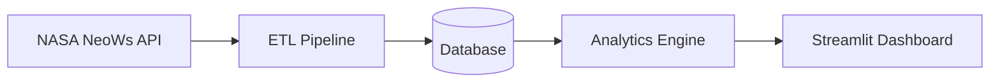
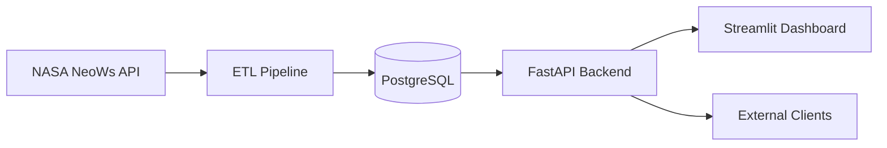

# System Architecture

## High-Level Flow

---

## Component Overview

### NASA NeoWs API Layer

Responsible for retrieving near-Earth object data from NASA's NeoWs (Near Earth Object Web Service).

Primary responsibilities:
- Authenticate using NASA API key
- Fetch asteroid, close-approach, and orbital-parameter data
- Handle API requests, retries, and rate-limit backoff
- Validate response shape before downstream processing

Primary modules:
- `src/etl/fetch_neows.py` — the NeoWs feed (asteroids + close approaches)
- `src/etl/fetch_orbital_parameters.py` — per-asteroid orbital detail lookups

Retry/timeout/backoff behavior is environment-configurable (see `docs/configuration.md`) rather than hardcoded.

---

### ETL Pipeline

Handles the Extract, Transform, and Load workflow for incoming API data, orchestrated end-to-end by `src/run_pipeline.py`.

#### Extract
Retrieve raw data from NASA APIs (`src/etl/`).

#### Transform
Clean, normalize, validate, and structure incoming records.

Primary modules:
- `src/parsing/parse_asteroids.py`, `src/parsing/parse_close_approaches.py`, `src/parsing/utils.py` — shape raw NeoWs feed JSON into DB-ready records
- `src/transform/transform_neows.py` — shape raw orbital-parameter JSON into DB-ready records

#### Load
Store processed records for analytics and dashboard consumption.

Primary module:
- `src/db/` — `connection.py` (connection factory), `init_db.py` (schema bootstrap), `load_asteroids.py`, `load_close_approaches.py`, `load_orbital_parameters.py` (upsert inserts), `log_ingestion.py` (per-run audit log: `ingestion_runs`/`ingestion_failures`)

---

### Database Layer

Stores processed application and analytics data.

Current implementation target:
- SQLite (local development), schema defined in `sql/schema.sql`

Potential future implementation:
- PostgreSQL (production-scale deployment)

Primary module:
- `src/db/connection.py`

Responsibilities:
- Data persistence
- Query management
- Record indexing
- Historical data retention
- Ingestion run auditing (`src/db/log_ingestion.py`)

---

### Analytics Engine

Processes stored data and generates analytical insights and scoring metrics.

Primary module:
- `src/models/risk_score.py`

Scoring weights live in `src/models/weights.json` (single source of truth — the dashboard reads the same file via `risk_score.get_weights()` rather than keeping its own copy).

Current analytics:
- Hazard classification (potentially-hazardous-object flag, sourced from NASA)
- Composite risk scoring: weighted combination of size, proximity, velocity, and encounter frequency
- Per-feature contribution breakdown (`explain_score`)

See `docs/risk_model_design.md` and `docs/risk_model_card.md` for the full methodology and documented limitations.

---

### Streamlit Dashboard

Provides the user-facing analytics and visualization interface. Read-only against the database — all writes happen upstream via the ETL pipeline.

Primary modules:
- `src/dashboard/app.py` — entry point and Home page
- `src/dashboard/pages/` — `1_Risk_Rankings.py`, `2_Explorer.py`, `3_Analytics.py`, `4_Model_Card.py`
- `src/dashboard/data_service.py` — single data-access point for every page, `@st.cache_data`-cached
- `src/dashboard/layout.py`, `palette.py`, `ui_settings.py` — shared chrome, chart colors, and display constants

Dashboard responsibilities:
- Display asteroid analytics
- Present risk scores and their per-feature breakdown
- Visualize trends and metrics
- Support interactive search, filtering, and CSV export

See `docs/dashboard_architecture.md` for the detailed as-built dashboard architecture.

---

### Quality & Deployment Infrastructure

Added in Epic 7 to make the platform testable, reliably reproducible, and safe to change.

- **Configuration** (`src/config.py`) — every deployment-relevant value (secrets, HTTP tuning, logging) is centralized and environment-overridable. See `docs/configuration.md`.
- **Automated testing** (`tests/`) — unit and integration tests for parsing, the database layer, the risk engine, and the dashboard's data service, run via `pytest`. See `docs/testing_strategy.md`.
- **Continuous Integration** (`.github/workflows/ci.yml`) — lint (`flake8`) and the full test suite run on every push and pull request; `main` requires this check to pass before merging.
- **Containerization** (`Dockerfile`, `.dockerignore`) — reproducible execution via Docker, with the local database mounted as a volume rather than baked into the image. See `docs/docker.md`.

---

## Planned Workflow

1. Retrieve asteroid data from NASA NeoWs API
2. Transform and validate incoming records
3. Store processed data in database
4. Run analytics and scoring pipelines
5. Visualize insights in Streamlit dashboard

---

## Future Scaling Opportunities

### PostgreSQL Migration

Transition from local SQLite storage to PostgreSQL for:
- improved scalability
- concurrent access support
- production-grade persistence
- larger analytical workloads

---

### FastAPI Service Layer

Introduce a FastAPI backend to expose:
- analytics endpoints
- risk scoring APIs
- processed asteroid datasets
- integration interfaces for external systems

Potential future architecture:

---

### Cloud Deployment

Deploy the platform to cloud infrastructure for:
- public dashboard hosting
- scheduled ETL execution
- automated deployments
- persistent cloud databases
- multi-user access
- scalable analytics workloads

Potential deployment targets:
- AWS
- Azure
- Google Cloud
- Render
- Railway
- Streamlit Cloud

---

## Development Tooling

Current development environment includes:
- Python virtual environments
- Black formatting, Flake8 linting
- pytest + pytest-cov, scoped to the tested core (see `docs/testing_strategy.md`)
- GitHub Actions CI (lint + test on every push/PR)
- Docker (see `docs/docker.md`)
- VS Code debugging profiles, real-time lint diagnostics
- Git branch protections, feature-branch workflow

---

## Long-Term Vision

The platform is designed to evolve from a local analytics prototype into a scalable near-Earth object analytics and risk intelligence platform capable of supporting:
- large-scale data ingestion
- automated ETL workflows
- cloud-hosted dashboards
- API-based integrations
- production analytics pipelines