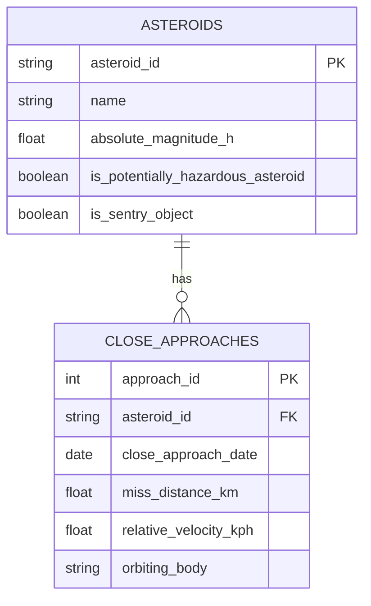

# Entity Mapping

## Purpose

This document identifies candidate relational entities from the raw NASA NeoWs JSON payload.

## Candidate Entities

| JSON Section | Candidate Table | Reason |
|---|---|---|
| near_earth_objects date-grouped asteroid records | asteroids | Each object represents a unique NEO |
| close_approach_data | close_approaches | Repeating event data for asteroid flybys |
| orbital_data | orbital_parameters | Orbital metadata associated with an asteroid |

## Entity: asteroids

Description:
Stores one row per unique asteroid.

Primary key:
asteroid_id

Source fields:
- id
- neo_reference_id
- name
- nasa_jpl_url
- absolute_magnitude_h
- is_potentially_hazardous_asteroid
- is_sentry_object

## Entity: close_approaches

Description:
Stores one row per close approach event.

Primary key:
approach_id

Foreign key:
asteroid_id references asteroids.asteroid_id

Source fields:
- close_approach_date
- close_approach_date_full
- relative_velocity
- miss_distance
- orbiting_body

---

# Relationships

## Asteroid → Close Approaches

Relationship Type:
One-to-Many (1:N)

Explanation:
A single asteroid can make multiple close approaches to Earth over time.

asteroids
---------
asteroid_id (PK)

close_approaches
----------------
approach_id (PK)
asteroid_id (FK)

## Entity Relationship Diagram

