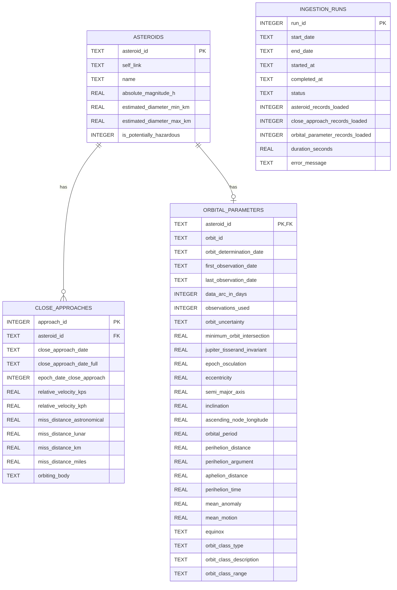

```mermaid
erDiagram

    ASTEROIDS ||--o{ CLOSE_APPROACHES : has
    ASTEROIDS ||--o| ORBITAL_PARAMETERS : has

    ASTEROIDS {
        TEXT asteroid_id PK
        TEXT self_link
        TEXT name
        REAL absolute_magnitude_h
        REAL estimated_diameter_min_km
        REAL estimated_diameter_max_km
        INTEGER is_potentially_hazardous
    }

    CLOSE_APPROACHES {
        INTEGER approach_id PK
        TEXT asteroid_id FK
        TEXT close_approach_date
        TEXT close_approach_date_full
        INTEGER epoch_date_close_approach
        REAL relative_velocity_kps
        REAL relative_velocity_kph
        REAL miss_distance_astronomical
        REAL miss_distance_lunar
        REAL miss_distance_km
        REAL miss_distance_miles
        TEXT orbiting_body
    }

    ORBITAL_PARAMETERS {
        TEXT asteroid_id PK, FK
        TEXT orbit_id
        TEXT orbit_determination_date
        TEXT first_observation_date
        TEXT last_observation_date
        INTEGER data_arc_in_days
        INTEGER observations_used
        TEXT orbit_uncertainty
        REAL minimum_orbit_intersection
        REAL jupiter_tisserand_invariant
        REAL epoch_osculation
        REAL eccentricity
        REAL semi_major_axis
        REAL inclination
        REAL ascending_node_longitude
        REAL orbital_period
        REAL perihelion_distance
        REAL perihelion_argument
        REAL aphelion_distance
        REAL perihelion_time
        REAL mean_anomaly
        REAL mean_motion
        TEXT equinox
        TEXT orbit_class_type
        TEXT orbit_class_description
        TEXT orbit_class_range
    }

    INGESTION_RUNS {
        INTEGER run_id PK
        TEXT start_date
        TEXT end_date
        TEXT started_at
        TEXT completed_at
        TEXT status
        INTEGER asteroid_records_loaded
        INTEGER close_approach_records_loaded
        INTEGER orbital_parameter_records_loaded
        REAL duration_seconds
        TEXT error_message
    }
```